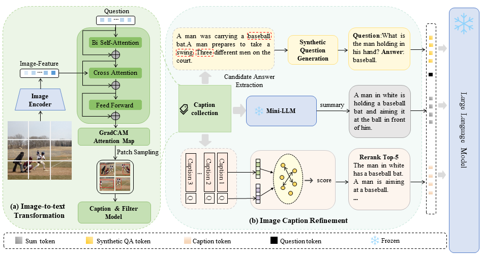

# SCRA-VQA: Summarized Caption-Rerank for Augmented Large Language Models in Visual Question Answering

This repo provides the source code & data of our paper [SCRA-VQA: Summarized Caption-Rerank for Augmented Large Language Models in Visual Question Answering]() (Oral paper accepted by DASFAA 2025).



## 1. Dependencies

*   [Python](https://www.python.org/) == 3.8
*   [PyTorch](https://pytorch.org/get-started/locally/) >=1.2&#x20;
*   [transformers](https://github.com/huggingface/transformers/tree/v3.4.0) == 4.21.3

## 2. Download data

To reproduce these evaluation results, you can follow the next steps:

Firstly, you should download the generated caption question files from this [link](https://drive.google.com/drive/folders/1KbBrWTac5YuG_b6CVEWM4jYwpR_YbcEO?usp=sharing) and put them in the `caption_question_files` folder. Then download the 2014\_coco val anotation file in  [link](https://cocodataset.org/), and put it in `annotation_new` folder.

The file structure should look like this:

```plain
├── README.md
├── annotation_new/
|    ├──mscoco_val2014_annotations.jeson
|    ├──okvqa_val_eval.json                       
|    ├──...
├── caption_quesiton_flies/
|    ├── okvqa_ans_to_cap_dict.json
|    ├── okvqa_caption.json
|    ├── okvqa_question.json
|    ├── ...
├── VL_captioning
|    ├── SCRA-VQA.py
|    ├── run_okvqa.sh
|    ├── untils.py
|    ├── ...
```

## 3. Evaluating&#x20;

To evaluate OK-VQA on SCRA-VQA, run

    bash ./run_okvqa.sh

## 4. Acknowledgment

This repo is built upon the following work:

```
https://github.com/salesforce/LAVIS/tree/main/projects/img2llm-vqa
```

Many thanks to the authors and developers!

## Others

If you use any of our code, processed data, or pre-trained models, please cite:

```bib
```

